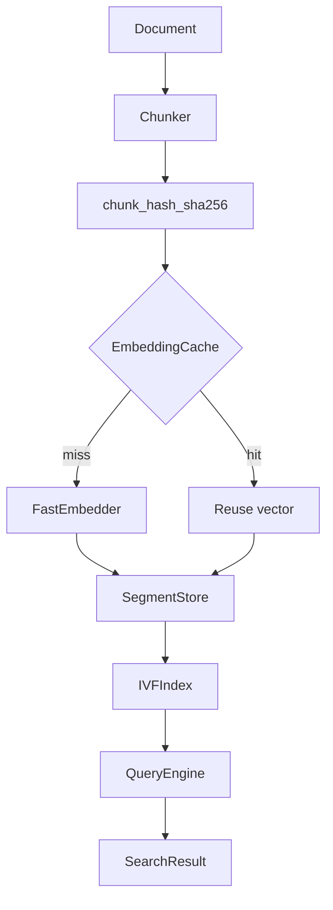
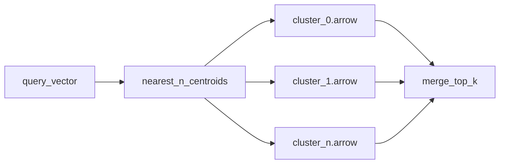

# AetherV Implementation Roadmap

## Current State (Phase 0 — Done)

The monolith in `old_single_code.py` has been modularized into [`aetherv/`](aetherv/). Phase 0 goals from [plan_description.md](plan_description.md) are largely complete:

| Goal | Status | Location |
|------|--------|----------|
| O(1) metadata lookup | Partial — keyed by `(segment, row)`, not `chunk_id` | [`aetherv/storage/metadata.py`](aetherv/storage/metadata.py) |
| Rich segment manifest | Done — `segment_id`, `vector_count`, `centroid_id`, `created_at` | [`aetherv/types.py`](aetherv/types.py), [`aetherv/storage/manifest.py`](aetherv/storage/manifest.py) |
| Brute-force GPU search | Done — scans all segments in parallel | [`aetherv/search/gpu.py`](aetherv/search/gpu.py), [`aetherv/db.py`](aetherv/db.py) |

**Remaining Phase 0 gap:** metadata lookup should eventually be keyed by content-derived `chunk_id` (SHA-256 of chunk text), not caller-supplied integer `id`. Sprint 1 closes this.

---

## Target Architecture



The core design principle from [plan_description.md](plan_description.md): **chunk identity over document identity** — unchanged chunks should never be re-embedded or re-indexed.

---

## Sprint 1 — Chunk Identity and Embedding Cache

**Goal:** Every chunk is identified by content hash; embeddings are cached and reused across inserts.

### New modules

- [`aetherv/chunking/hash.py`](aetherv/chunking/hash.py) — `compute_chunk_id(text: str) -> str` using SHA-256
- [`aetherv/storage/embedding_cache.py`](aetherv/storage/embedding_cache.py) — parquet or arrow store: `chunk_hash -> embedding + segment + row`

### Changes to existing code

- [`aetherv/storage/metadata.py`](aetherv/storage/metadata.py) — extend schema:

```python
SCHEMA = {
    "chunk_id": pl.String,   # sha256 hex
    "doc_id": pl.String,     # optional doc grouping
    "text": pl.String,
    "segment": pl.Int64,
    "row": pl.Int64,
}
```

- Add secondary O(1) lookup: `_by_chunk_id: dict[str, MetadataRow]`
- [`aetherv/db.py`](aetherv/db.py) — refactor `insert()`:
  1. Compute `chunk_id` per text
  2. Check embedding cache; skip embedder for cache hits
  3. Only embed cache misses
  4. Write new vectors to segments; update cache + metadata
- [`aetherv/config.py`](aetherv/config.py) — add `embedding_cache_filename: str = "embedding_cache.parquet"`
- Deprecate caller-supplied integer `ids` in favor of `doc_id` + auto `chunk_id` (keep backward-compat overload for one sprint)

### Success criteria

- Inserting the same chunk text twice produces zero embedder calls on second insert
- `metadata.get_by_chunk_id(chunk_id)` is O(1)
- Existing tests in [`tests/test_vectordb.py`](tests/test_vectordb.py) pass with updated API

---

## Sprint 2 — Incremental Document Updates

**Goal:** Updating a document re-embeds only changed chunks, not the whole document.

### New modules

- [`aetherv/chunking/chunker.py`](aetherv/chunking/chunker.py) — split documents into chunks (paragraph or fixed-token strategy; configurable)
- [`aetherv/update/differ.py`](aetherv/update/differ.py) — compare old vs new chunk sets

**Diff strategy (phased):**
1. **v1:** hash-set diff — match chunks by `chunk_id`; embed only new/changed hashes
2. **v2:** `difflib.SequenceMatcher` on chunk lists — handles reorder without re-embed (Phase 3 from plan_description)

### New API on VectorDB

```python
def upsert_document(self, doc_id: str, text: str) -> UpsertResult:
    """Chunk, diff against stored doc chunks, embed only deltas."""

def delete_document(self, doc_id: str) -> None:
    """Remove doc chunks from metadata; mark vectors tombstoned."""
```

### Changes

- Track `doc_id -> set[chunk_id]` index in metadata or a separate [`aetherv/storage/doc_index.py`](aetherv/storage/doc_index.py)
- Tombstone deleted chunks in metadata (don't rewrite arrow segments yet — deferred to Sprint 4 compaction)

### Success criteria

- Document with 4 paragraphs, 1 changed → exactly 1 embedder call
- Reordered paragraphs (same text) → 0 embedder calls (v2 diff)

---

## Sprint 3 — IVF Index (First ANN)

**Goal:** Replace "search all segments" with centroid-routed search.



### New modules

- [`aetherv/index/kmeans.py`](aetherv/index/kmeans.py) — train KMeans on all vectors (default: 1024 centroids for ~100k vectors; configurable)
- [`aetherv/index/centroids.py`](aetherv/index/centroids.py) — read/write `centroids.arrow`; assign vectors to nearest centroid
- [`aetherv/index/ivf.py`](aetherv/index/ivf.py) — `IVFIndex` with `build()`, `search(query, k, nprobe=5)`
- [`aetherv/storage/clusters/`](aetherv/storage/clusters/) — `cluster_{id}.arrow` posting lists (replaces flat segment layout for indexed data)

### Changes

- [`aetherv/db.py`](aetherv/db.py) — `query()` routes through `IVFIndex` when built; fall back to brute-force if no index
- [`aetherv/types.py`](aetherv/types.py) — manifest gains `centroid_id` per cluster file (field already exists on `SegmentRecord`)
- New config: `num_centroids: int = 1024`, `nprobe: int = 5`

### Success criteria

- `build_index()` trains centroids and partitions vectors into cluster files
- Query searches only `nprobe` clusters, not all segments
- Recall@k within acceptable threshold vs brute-force on test set (e.g. > 95% overlap)

---

## Sprint 4 — Incremental IVF Maintenance

**Goal:** New vectors append to nearest centroid without full retrain; writes scale via delta segments.

### New modules

- [`aetherv/index/maintenance.py`](aetherv/index/maintenance.py) — assign new vector to nearest centroid on insert
- [`aetherv/storage/delta.py`](aetherv/storage/delta.py) — LSM-style layout:

```
clusters/cluster_12_base.arrow
clusters/cluster_12_delta_001.arrow
```

- [`aetherv/index/compaction.py`](aetherv/index/compaction.py) — background merge of base + deltas into new base

### Search changes

- [`aetherv/search/gpu.py`](aetherv/search/gpu.py) — `ClusterSearcher` reads base + all deltas, concatenates for search (or lazy merge)

### Success criteria

- Insert after index build does not trigger full KMeans retrain
- Delta files accumulate; compaction merges them
- Cluster size imbalance detectable (prep for Sprint 7 rebalancing)

---

## Sprint 5 — HNSW Inside IVF Clusters

**Goal:** Replace brute-force within each probed cluster with HNSW for better recall at scale.

### New modules

- [`aetherv/index/hnsw.py`](aetherv/index/hnsw.py) — per-cluster HNSW graph (use `hnswlib` or lightweight custom implementation)
- [`aetherv/search/hybrid.py`](aetherv/search/hybrid.py) — IVF routing + HNSW per cluster + global top-k merge

### Architecture

```
Query → nearest 5 centroids → HNSW search per cluster → merge top-k
```

### Success criteria

- Search latency improves vs brute-force cluster scan at 10k+ vectors per cluster
- Recall@k matches or exceeds Sprint 3 brute-force cluster search

---

## Sprint 6 — GPU Cache and Batch Query Engine

**Goal:** Keep hot data on GPU; support multi-query batching.

### New modules

- [`aetherv/search/gpu_cache.py`](aetherv/search/gpu_cache.py) — LRU cache: centroids + hot cluster vectors on GPU
- [`aetherv/search/batch.py`](aetherv/search/batch.py) — `query_batch(texts: list[str], k: int) -> list[list[SearchResult]]`

### Changes

- [`aetherv/search/gpu.py`](aetherv/search/gpu.py) — avoid per-query `device_put`; reuse cached GPU arrays
- Cold clusters loaded from disk on demand; evicted via LRU

### Success criteria

- Repeated queries against same clusters skip disk reads
- Batch of N queries faster than N sequential queries (amortized JAX overhead)

---

## Sprint 7 — Semantic Diff and Self-Healing

**Goal:** Research-level optimizations — avoid re-embedding near-identical text; keep index healthy over time.

### New modules

- [`aetherv/update/semantic_diff.py`](aetherv/update/semantic_diff.py) — compare old vs new chunk embeddings; if cosine > 0.98, update metadata only (no re-embed)
- [`aetherv/index/rebalance.py`](aetherv/index/rebalance.py) — detect imbalanced clusters; background recluster
- [`aetherv/index/healing.py`](aetherv/index/healing.py) — periodic consistency checks: metadata ↔ cache ↔ index alignment

### Success criteria

- `"hello world"` → `"hello world."` does not trigger embedder call when cosine > threshold
- Rebalancing triggered when cluster size exceeds `max_cluster_ratio * avg_cluster_size`
- Healing job detects and repairs orphaned cache entries or stale tombstones

---

## Recommended Package Layout (End State)

```
aetherv/
├── chunking/          # hash, chunker
├── storage/           # arrow, manifest, metadata, embedding_cache, delta, doc_index
├── index/             # kmeans, centroids, ivf, hnsw, maintenance, compaction, rebalance, healing
├── search/            # gpu, hybrid, gpu_cache, batch
├── update/            # differ, semantic_diff
├── embedder.py
├── db.py              # VectorDB public API
├── config.py
└── types.py
```

---

## Dependencies to Add (by sprint)

| Sprint | New dependency | Purpose |
|--------|---------------|---------|
| 3 | `scikit-learn` or `faiss-cpu` | KMeans training |
| 5 | `hnswlib` | Per-cluster HNSW |
| 2 | none (stdlib `difflib`) | Positional diff v2 |

---

## Testing Strategy

Each sprint adds tests to [`tests/`](tests/) using the existing `DeterministicEmbedder` pattern (no model download):

- **Sprint 1:** cache hit/miss counts, chunk_id stability
- **Sprint 2:** partial document update embed count
- **Sprint 3:** IVF recall vs brute-force baseline
- **Sprint 4:** delta accumulation + compaction correctness
- **Sprint 5:** HNSW recall within cluster
- **Sprint 6:** cache hit rate, batch speedup
- **Sprint 7:** semantic diff threshold behavior, rebalance triggers

---

## Suggested Execution Order

Start with **Sprint 1** immediately — it unlocks Sprints 2 and 4 (embedding reuse is the foundation for incremental updates). Sprint 3 (IVF) can begin in parallel once Sprint 1 metadata schema is stable, but Sprint 2 should land before Sprint 4 since delta/tombstone semantics depend on document-level diffing.

```mermaid
gantt
    title Sprint Dependencies
    dateFormat X
    axisFormat %s
    section Identity
    Sprint1_ChunkCache     :s1, 0, 1
    Sprint2_Incremental    :s2, after s1, 1
    section Index
    Sprint3_IVF            :s3, after s1, 1
    Sprint4_DeltaIVF       :s4, after s2 s3, 1
    Sprint5_HNSW           :s5, after s4, 1
    section Scale
    Sprint6_GPUCache       :s6, after s5, 1
    Sprint7_SemanticHeal   :s7, after s6, 1
```


